# 🖋️ Multilingual Handwriting Recognition App

<div align="center">


</div>

## 🌟 Transform Your Handwriting Into Any Language!

> **Turn your scribbles into multilingual masterpieces!** This powerful desktop application recognizes handwritten text and instantly translates it into over 20 languages with real-time processing and audio pronunciation.

---

## ✨ Features That Will Amaze You

### 🎨 **Smart Drawing Canvas**
- **Interactive Drawing**: Natural pen and eraser tools
- **Real-time Recognition**: See results as you write
- **Image Upload**: Process existing handwritten images
- **Crystal Clear Processing**: Advanced image enhancement algorithms

### 🌍 **Multilingual Magic**
- **20+ Languages Supported**: From English to Arabic, Chinese to Spanish
- **Instant Translation**: Google Translate integration
- **Language Swapping**: Quick source-target language switching
- **Audio Pronunciation**: Hear how words sound in target language

### 🧠 **AI-Powered Recognition**
- **Tesseract OCR Engine**: Industry-standard text recognition
- **Image Enhancement**: Automatic noise reduction and text optimization
- **Multiple Input Methods**: Draw, upload, or paste images
- **Adaptive Processing**: Optimized for various handwriting styles

---

## 🚀 Quick Start

### Prerequisites
```bash
# Install Python 3.8+
python --version

# Install Tesseract OCR
# Windows: Download from https://github.com/UB-Mannheim/tesseract/wiki
# macOS: brew install tesseract
# Linux: sudo apt-get install tesseract-ocr
```

### Installation
```bash
# Clone the repository
git clone https://github.com/your-username/HandwrittenDigitRecognitionApp.git
cd HandwrittenDigitRecognitionApp

# Install dependencies
pip install opencv-python-headless numpy tensorflow pillow tk pytesseract googletrans==4.0.0rc1 gtts pygame requests wikitextparser

# Run the application
python APP_DEV_PROJECT.py
```

---

## 🎯 How It Works

```mermaid
graph LR
    A[✍️ Write/Upload] --> B[🔍 OCR Processing]
    B --> C[🌐 Translation]
    C --> D[🔊 Audio Output]
    D --> E[📖 Word Definitions]
```

<div align="center">



</div>

### 1. **Write or Upload**
- Draw directly on the canvas with intuitive pen tools
- Upload existing handwritten images (PNG, JPG, etc.)
- Real-time processing as you write

### 2. **Smart Recognition**
- Advanced image preprocessing for optimal OCR
- Tesseract engine extracts text with high accuracy
- Support for multiple languages and writing styles

### 3. **Instant Translation**
- Google Translate API for accurate translations
- 20+ language pairs supported
- Bi-directional translation capabilities

### 4. **Rich Output**
- Audio pronunciation using Google Text-to-Speech
- Word definitions and usage examples
- Pronunciation guides and language information

---

## 📱 User Interface

<div align="center">

| Feature | Description |
|---------|-------------|
| 🖌️ **Drawing Canvas** | Interactive white canvas for natural writing |
| 🎛️ **Tool Selection** | Pen and eraser with customizable sizes |
| 🌐 **Language Picker** | Dropdown menus for source and target languages |
| ⚡ **Real-time Toggle** | Enable/disable live recognition |
| 🔊 **Audio Player** | Built-in pronunciation player |
| 📚 **Definition Panel** | Contextual word meanings and examples |

</div>

---

## 🎨 Supported Languages

<div align="center">

| 🇺🇸 English | 🇪🇸 Spanish | 🇫🇷 French | 🇩🇪 German |
|-------------|-------------|------------|-----------|
| 🇨🇳 Chinese | 🇯🇵 Japanese | 🇰🇷 Korean | 🇷🇺 Russian |
| 🇦🇪 Arabic | 🇮🇳 Hindi | 🇵🇭 Filipino | 🇮🇹 Italian |
| 🇵🇹 Portuguese | 🇳🇱 Dutch | 🇬🇷 Greek | 🇹🇷 Turkish |
| 🇻🇳 Vietnamese | 🇹🇭 Thai | 🇵🇱 Polish | 🇸🇪 Swedish |
| 🇮🇩 Indonesian | 🇵🇭 Cebuano | | |

</div>

---

## 🛠️ Technical Architecture

### Core Components
```python
🧱 Core Technologies:
├── 🖼️ OpenCV - Image Processing
├── 👁️ Tesseract OCR - Text Recognition  
├── 🌐 Google Translate API - Translation
├── 🎵 gTTS + Pygame - Audio Generation
├── 🖥️ Tkinter - GUI Framework
└── 🐍 Python 3.8+ - Runtime Environment
```

### Key Features Implementation
- **Real-time Processing**: Stroke completion detection with configurable delays
- **Image Enhancement**: Adaptive thresholding, noise reduction, and morphological operations
- **Error Handling**: Robust exception management and user feedback
- **Audio Management**: Temporary file handling and cleanup
- **Multi-threading**: Concurrent API calls for better performance

---

## 📋 Project Structure

```
HandwrittenDigitRecognitionApp/
├── 📄 APP_DEV_PROJECT.py     # Main application file
├── 📖 README.md              # Project documentation
├── 📊 requirements.txt       # Python dependencies
├── 🗂️ docs/                 # Additional documentation
├── 🧪 tests/                # Unit tests
├── 📷 screenshots/          # Application screenshots
└── 📦 assets/               # Static resources
```

---

## 🎯 Development Roadmap

### ✅ Completed Features
- [x] Multi-language OCR recognition
- [x] Real-time handwriting detection
- [x] Audio pronunciation
- [x] Word definitions and examples
- [x] Image upload and processing

### 🚧 In Progress
- [ ] Mobile app version
- [ ] Cloud storage integration
- [ ] Collaborative features
- [ ] Advanced drawing tools

### 🔮 Future Plans
- [ ] Machine learning model training
- [ ] Offline language packs
- [ ] Voice input recognition
- [ ] PDF export functionality

---

## 🤝 Contributing

We welcome contributions! Here's how you can help:

1. **🍴 Fork** the repository
2. **🌿 Create** a feature branch (`git checkout -b feature/AmazingFeature`)
3. **💾 Commit** your changes (`git commit -m 'Add some AmazingFeature'`)
4. **📤 Push** to the branch (`git push origin feature/AmazingFeature`)
5. **🔀 Open** a Pull Request

### 📝 Development Guidelines
- Follow PEP 8 style guidelines
- Add unit tests for new features
- Update documentation as needed
- Test across different operating systems

---

## 📸 Screenshots

<div align="center">

| Main Interface | Real-time Recognition | Translation Results |
|----------------|----------------------|-------------------|
|  | |  |


</div>

---

## 🐛 Troubleshooting

### Common Issues

<details>
<summary><strong>🚫 Tesseract not found error</strong></summary>

**Solution**: Ensure Tesseract is installed and path is configured:
```bash
# Windows
set TESSDATA_PREFIX=C:\Program Files\Tesseract-OCR\tessdata

# macOS/Linux  
export TESSDATA_PREFIX=/usr/local/share/tessdata
```
</details>

<details>
<summary><strong>📶 Translation API errors</strong></summary>

**Solution**: Check internet connection and API limits:
- Verify network connectivity
- Try different source/target language combinations
- Wait a moment if rate limited
</details>

<details>
<summary><strong>🔇 Audio not playing</strong></summary>

**Solution**: Check audio system and permissions:
- Verify system audio is working
- Check application permissions
- Try different text for pronunciation
</details>

---

## 📄 License

This project is licensed under the MIT License - see the [LICENSE](LICENSE) file for details.

---

## 👥 Team

<div align="center">

| Role | Responsibilities |
|------|-----------------|
| **👨‍💻 Developer 1** | GUI Design & Canvas Implementation |
| **👩‍💻 Developer 2** | AI Integration & Image Processing |
| **🎨 UI/UX Designer** | User Interface & Experience |
| **🧪 QA Tester** | Quality Assurance & Bug Testing |

</div>

---

## 🙏 Acknowledgments

- **Tesseract OCR** team for the powerful recognition engine
- **Google Translate** for translation services
- **OpenCV** community for computer vision tools
- **Python** community for the amazing ecosystem

---

<div align="center">

### 🌟 Star this repository if you found it helpful!

**Made with ❤️ and lots of ☕**

[⬆ Back to Top](#-multilingual-handwriting-recognition-app)

</div>
